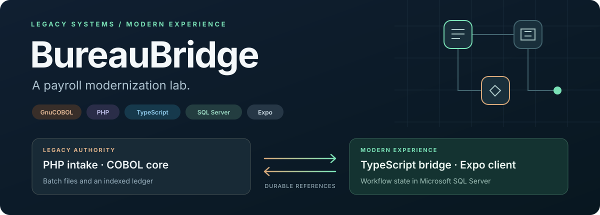
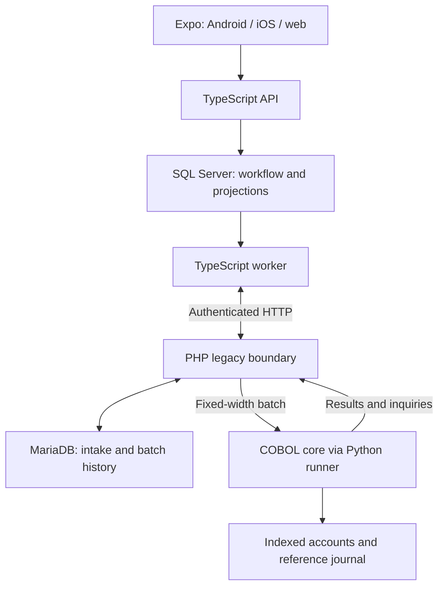
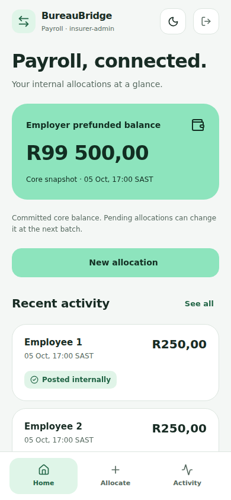
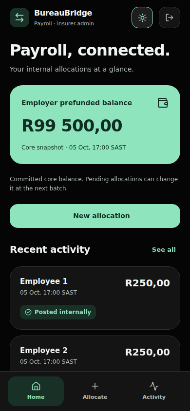

<div align="center">



**Recover a missing batch result without posting twice.**

A financial systems portfolio project connecting PHP and a real COBOL core to TypeScript, Microsoft SQL Server, and Expo.

[](https://github.com/CalebLouwskitter/bureau-bridge/actions/workflows/validate.yml)
[](services/server)
[](database/modern)
[](legacy/cobol)
[](legacy/php)
[](apps/mobile)

[Architecture](docs/architecture.md) · [Run the demo](#run-the-demo) · [Recovery walkthrough](#the-demo-to-try-first) · [Validation evidence](docs/validation.md)

</div>

## The situation

A fictional South African payroll bureau has been acquired by a fintech. Its operators use a PHP portal, while a COBOL batch processor owns the internal ledger in indexed files. An insurer is the first employer client. The new product needs mobile access, clearer status, and reliable recovery while the existing core keeps running.

BureauBridge allocates prefunded employer value to employee payable accounts in **ZAR cents**. The app calls this **Posted internally**; an external bank payout is a future workflow.

The interesting failure happens between systems: COBOL commits an allocation, but its result never reaches PHP. The modern app sees an unresolved request. Recovery must find the original posting, preserve its reference, and restore the displayed outcome.

## What the project demonstrates

| Engineering problem | Implementation |
| --- | --- |
| Connecting old and new interfaces | Authenticated PHP machine endpoints over the same intake and fixed-width batch path used by operators |
| Durable delivery | SQL Server request/outbox transaction, leased worker jobs, bounded retries, and immutable request references |
| Preventing duplicate ledger changes | Core processed-reference journal, payload conflict checks, and replay-safe recovery |
| Committing file-based state together | Serialized Python runner publishes closed account/journal files as one durable generation |
| Keeping financial authority clear | COBOL owns balances; SQL Server holds workflow state and timestamped read projections |
| Explaining unresolved outcomes | Inquiry and verified resumption, final-status protection, and allocation history |
| Finding discrepancies | Reconciliation of modern requests, PHP intake, core outcomes, batch controls, and journal-derived balances |
| Serving different users | Payroll, employee, and operations views in an Expo app; role and account ownership checks in the API |

## Architecture



Requests cross an asynchronous boundary. Intake is an acknowledgement; a core result establishes the financial outcome. The wrapper copies the current indexed files, invokes COBOL, checks results and balance conservation, syncs the generation, and atomically replaces the `current` symlink. A failure before publication retains the previous ledger. A failure after publication can be resolved from the journal.

The core is intentionally a single writer on a local Linux filesystem. Read projections show their core timestamp and source generation. [The architecture decisions](docs/adr/0001-ledger-authority.md) explain the authority boundary, and [the recovery decision](docs/adr/0002-delivery-and-recovery.md) explains retries and inquiry.

## Mobile experience

**Soft fintech · Tamagui · light first · black and mint dark mode.**

The Expo client pairs a mint balance card and rounded surfaces with **Home / Allocate / Activity** bottom tabs. Employees get their own balance and activity; operations gets a dedicated reconciliation tab. The appearance toggle remembers your choice. Allocation retries retain their original reference, including after an app restart.

| Light — default | Black + mint |
| --- | --- |
|  |  |

Browser captures of the implemented Expo interface using fictional UI-test fixtures. [Design tokens, role views, and local verification](docs/mobile-design.md) document the mobile slice. This feature branch uses focused commits with CI skipped; the badge above tracks `main`.

## Run the demo

Use **Node.js 24**, **Docker Compose**, and Docker configured for Linux containers. On Windows, use Docker Desktop. SQL Server uses the `linux/amd64` image; other host architectures need a compatible Docker setup.

```powershell
git clone https://github.com/CalebLouwskitter/bureau-bridge.git
cd bureau-bridge
node scripts/setup.mjs
npm ci
docker compose up --build -d
docker compose ps
npm run web
```

Setup generates separate local credentials in `.env` and preserves an existing file. Read your own `DEMO_PASSWORD` there; generated secrets are excluded from Git. Keep that file when reusing initialized database volumes.

| Entry point | Address / user |
| --- | --- |
| Expo web | URL printed by Expo, normally `http://localhost:8081` |
| Modern API health | `http://localhost:3000/health` |
| PHP operations portal | `http://localhost:8080` · `operator` |
| Employer experience | Expo username `insurer-admin` |
| Employee experience | Expo username `employee-one` · own account only |
| Reconciliation and recovery | Expo username `ops` |

All demo usernames use your generated `DEMO_PASSWORD`. The signed demo sessions and PHP development server are part of the local lab setup.

For **Android/iOS**, run `npm run mobile` to start Expo Go. Android emulator API access defaults to `10.0.2.2:3000`; iOS simulator defaults to `localhost:3000`. A physical phone needs your PC's LAN API address. [Mobile setup, EAS profiles, and HTTPS configuration](docs/development.md#android-and-ios) cover those steps.

## The demo to try first

1. Sign in as `insurer-admin`, open **Allocate**, send **R250.00** to Employee 1, and wait for **Awaiting payroll batch**.
2. Run a normal batch from the PHP portal or terminal:

   ```powershell
   docker compose exec legacy php /app/php/batch.php
   ```

   The allocation becomes **Posted internally** after the core result is imported.

3. Submit another allocation, wait for the same batch-ready state, and deliberately withhold the next result:

   ```powershell
   docker compose exec legacy php /app/php/batch.php --drop-result
   ```

   The command exits with an injected error **after core commit**. The displayed request becomes **Verifying core outcome**.

4. Sign in as `ops`, open **Activity**, and choose **Run core inquiry**. The core returns the original journal outcome. PHP imports it, and the worker updates the modern view using the same reference.
5. Open **Ops** and run **Run comparison** to inspect the captured state across systems and export its CSV report. During the unresolved interval, a comparison can show that the core has posted while an import is pending.

The separate **Verify and resume** action checks the journal before requeueing an unposted request. A committed request keeps its final outcome. [The executable core tests](tests/test_core.py) exercise publication failures and concurrent replay directly.

Try Employee 3 to see the core decline a **suspended account**. The seeded prefunded balance is **R100,000**, the per-allocation limit is **R50,000**, and the client stores an unfinished request before transmission so retries preserve its reference.

## Balances and operations

The app includes balances with a core timestamp, an allocation register, status history, and an operations reconciliation view. The worker refreshes account projections every **30 seconds** and saves a comparison every **300 seconds**; both intervals are configurable. Legacy batches run at **08:00, 12:00, 16:00, and 23:00** in Johannesburg time, with operator-triggered runs using the same protocol.

Reconciliation checks payloads, terminal outcomes, missing references, pending imports, batch counts/totals, and seed-plus-journal balances. PHP-origin requests appear as informational legacy work. Comparisons are observations that can overlap an import; they do not automatically repost money. The **5000-record demo limit** is explicit, and incomplete scans cannot report a clean match.

The PHP portal exports request and batch-control CSVs. The modern operations view exports reconciliation CSVs: web downloads a file, while native clients share CSV text.

## Validation status

These results combine the local second review with a [successful full GitHub CI run](https://github.com/CalebLouwskitter/bureau-bridge/actions/runs/36699107346). The CI badge links to the repository's current workflow status.

| Validation | Evidence |
| --- | --- |
| TypeScript checks | API, worker, contracts, and Expo compile |
| API / worker / reconciliation | **14 tests passed**, using a fake persistence boundary |
| Real COBOL core | **7 tests passed**, including duplicate/conflicting references, suspension, publication faults, read-only audit, and preserved v0.1 indexed-file upgrades |
| Real PHP + MariaDB + COBOL | Posting, lost-result recovery, verified resumption, batch controls, and final outcome protection passed |
| Real HTTP integration | TypeScript legacy client, authenticated reports, operator session/form token, and credential boundaries passed |
| Expo | Android/iOS Hermes and web bundles exported; native HTTP/HTTPS config introspected |
| Compose | Configuration validation passed |
| Real SQL Server | Migrations, concurrent idempotent creation, exclusive/stale leases, final-status protection, account projection ordering, and persisted reconciliation passed in CI |
| Docker / complete stack | Container build/startup, real legacy integration, and full-stack posting/recovery/reconciliation smoke passed in CI |
| Remaining device gate | Native Android/iOS binaries, device networking, UI interactions, and native sharing still need build and device checks |

[The full evidence](docs/validation.md) distinguishes compilation and isolated tests from actual runtime checks. [The requirements review](docs/second-review.md) records the fixes and remaining scope. JavaScript bundles exported successfully; signed device binaries still need build and device validation.

```powershell
npm run typecheck
npm test
```

On Linux with GnuCOBOL installed:

```bash
npm run test:core
```

The [CI workflow](.github/workflows/validate.yml) includes real legacy integration, SQL Server checks, and the complete-stack smoke scenario. Use a disposable fresh lab for the [full acceptance commands](docs/validation.md#remaining-acceptance-gate).

## Explore the repository

| Path | What to inspect |
| --- | --- |
| [`apps/mobile`](apps/mobile) | Expo screens, role views, retry persistence, and native config |
| [`packages/contracts`](packages/contracts) | Shared money/request contracts and validation |
| [`services/server`](services/server) | API, worker, SQL store, reconciliation, and tests |
| [`legacy/php`](legacy/php) | Portal, authenticated endpoints, batch export/import, and reports |
| [`legacy/cobol`](legacy/cobol) | Executable allocation rules and indexed record layouts |
| [`legacy/core-runner.py`](legacy/core-runner.py) | Generation publication, inquiry, audit, and upgrades |
| [`database`](database) | MariaDB and Microsoft SQL Server schema scripts |
| [`docs/development.md`](docs/development.md) | Detailed setup, API routes, upgrades, shutdown, and the PHP refresher |
| [`docs/file-contract.md`](docs/file-contract.md) | The 75-byte request and 139-byte result boundary |

## Next slices

Finish native build and device acceptance, then extend employer/operator catalogs, bulk payroll imports, identity integration, retention and backup/restore, and an external payout simulation. The current fixture models one employer and internal allocations with fictional data.

See [CONTRIBUTING.md](CONTRIBUTING.md) for the project boundaries and verification routes.
