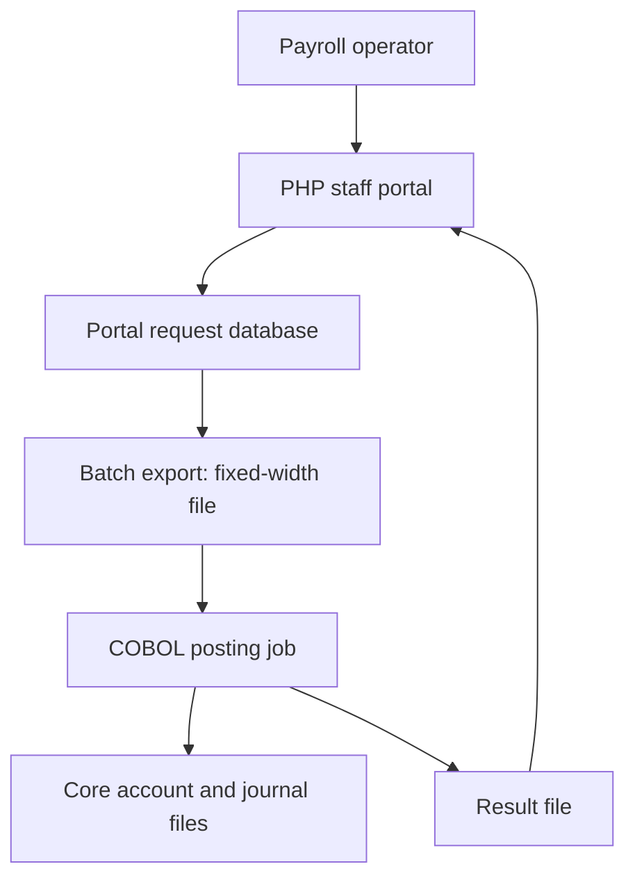

# FinTech Legacy Bridge — infrastructure draft v0.7

**Status:** the second requirements review corrected missing balance views, reconciliation/reporting, and recovery protections in BureauBridge v0.2. TypeScript, core recovery/upgrade, real PHP/MariaDB/COBOL HTTP integration, and Expo platform bundle checks pass. SQL Server runtime, complete Docker startup, and native device execution remain unverified. All identities, accounts, money, and institutions are fictional.

## The situation

**Confirmed scenario:** a South African payroll bureau has been acquired by a fintech that wants to offer modern employer and employee experiences. Its business clients include an insurer. The bureau's payroll operators use a PHP web portal, while a COBOL program allocates prefunded client money to employee payable accounts in batches. The existing system still runs the bureau's internal ledger, but its interfaces were designed for operators and scheduled files. The acquirer wants a new TypeScript and SQL Server system, eventually used by an Expo app, while the old core continues to own the ledger during the transition.

**Financial boundary:** the first demo's “internal transfer” moves fictional value from a client's prefunded payroll account to an employee payable account **inside the bureau's own ledger**. This is not a payment to the employee's bank account. An external bank payout file and confirmation process can be a later project slice; the UI must never label an internal allocation as “paid out.”

The old system did not start out with a PHP-to-COBOL API. Its integration point is a **file handoff**. That is the important constraint for the eventual bridge.

## What exists before our new system

| Legacy part     | Proposed implementation in our mock                              | What it owns                                                                                                                                                          |
| --------------- | ---------------------------------------------------------------- | --------------------------------------------------------------------------------------------------------------------------------------------------------------------- |
| Staff portal    | PHP pages and form handlers served by a web server               | Payroll operator login, allocation entry, employer request lookup, simple reports                                                                                     |
| Portal database | MariaDB, version 11.4 in Compose                                 | Requests, batch manifests/membership, imported status, and inquiry history; **not authoritative balances**. Demo identities and account catalog are seeded constants. |
| File exchange   | Controlled inbound and outbound directories                      | Fixed-width request file, result file, batch manifest, checksums and archives                                                                                         |
| Core processor  | GnuCOBOL program run by a scheduler or approved operator trigger | Payroll allocation rules, postings, core account master, processed references, and balance snapshots                                                                  |
| Core files      | COBOL indexed account and journal files                          | Authoritative prefunded client and employee payable balances, plus posting history in this mock                                                                       |
| Operations      | Staff reconciliation screen and exported reports                 | Investigate rejects, missing result files, mismatched counts and totals                                                                                               |

The portal database is an intake and display store. Its screen shows requests, imported outcomes, batch controls, and CSV exports. The modern app shows balances with their core commit timestamp. The implementation uses PHP 8.3 with intentionally old application boundaries and a fixed-width COBOL contract; it does not claim to recreate a specific payroll bureau's infrastructure.

## One transfer through the old infrastructure

1. At 14:00, a payroll operator enters a transfer of **R250.00** from a fictional insurer's prefunded payroll account to an employee payable account in the PHP portal. The portal creates a lowercase UUID reference, such as `00000000-0000-4000-8000-000000000001`, and displays **received for processing**. The ledger has not changed yet.
2. At a scheduled cutoff, or an authorized operator-triggered run, a PHP export job freezes a numbered batch of pending requests, converts the amount to **25,000 cents**, writes a fixed-width input file, and records the filename, row count, amount total, and checksum in a manifest.
3. The batch runner passes the checksum-checked file to COBOL. The job checks active client and employee accounts, limits, available prefunded balance, and whether the reference was already processed. It changes both account records and records the payload/outcome in the journal. The runner validates record shape and balance conservation before publication. The account master and journal are the authority for this **internal ledger allocation**.
4. COBOL writes a result row containing the original reference/payload, status, reason, and posting reference. Batch ID and count/amount controls are maintained by the surrounding PHP manifest and immutable database membership. PHP validates each result before updating displayed status.
5. An operator compares sent and received record counts and totals. Missing files, invalid records, and unmatched references require investigation. The operator can look up the result after the import; the PHP portal has no real-time posting status. **Posted internally** means the payable balance changed, not that an external bank transfer completed.

**Implemented recovery rule:** the COBOL side persists a processed-reference journal alongside account state. A Python runner serializes work, copies the current indexed files to a private generation, runs COBOL, validates results, syncs the closed files, and publishes the generation with one atomic symlink replacement. The tests cover failures on either side of publication, parallel replay, conflicting reference reuse, and balance conservation. This design assumes local Linux filesystem semantics and a single serialized core writer.

## Why modernization is needed

| Symptom visible to staff or customers                                 | Cause in this proposed legacy setup                                                        |
| --------------------------------------------------------------------- | ------------------------------------------------------------------------------------------ |
| Portal says “received” but cannot say when funds moved                | PHP knows request intake; COBOL owns final posting and publishes it later                  |
| One transfer looks stuck after a batch interruption                   | Request file, COBOL run, result file, and PHP import are separate steps                    |
| Staff are unsure whether a retry will duplicate work                  | Legacy reference lookup exists internally, but there is no clear external request contract |
| New employer/employee mobile app cannot directly query current status | The portal exposes staff pages and scheduled reports, not a supported customer API         |
| Overnight investigation takes manual effort                           | Staff compare batch IDs, row counts, totals, and missing references across systems         |

We should demonstrate a **lost result file after a successful posting**, then recover by core reference lookup without reposting. This is the signature integration problem, and it can be shown without pretending that COBOL itself is defective.

## Boundary for the future system

The implemented new stack is **TypeScript services, Microsoft SQL Server, and an Expo client with Android, iOS, and web bundles**. SQL Server holds requests, status history, a leased transactional outbox, timestamped balance projections, and reconciliation evidence. The TypeScript worker calls the PHP boundary; it never writes COBOL account files. Native application binaries and the SQL Server runtime have not yet been tested.

### Selected integration boundary

The selected boundary adds authenticated PHP **machine endpoints** for stable-reference intake, status, committed account snapshots, and reconciliation inventory. Intake uses the same database/export path as operator-entered requests. The bridge has its own credential and keeps delivery state in SQL Server. Expo calls only the modern API. A separate operations credential protects core inquiry and verify/resume endpoints.

If a result file disappears after core publication, an **operations-triggered inquiry** reads the reference journal and restores the recorded outcome without reposting. A separate explicit resume action requeues an unposted request only after the core returns `NOTFOUND`. The bridge presents verification pending while an outcome is unresolved. The real PHP/MariaDB/COBOL integration test passed both recovery paths.

The worker refreshes account projections every 30 seconds and saves a cross-system comparison every 300 seconds. Operations users can also run it on demand, inspect differences, and export CSV. The comparison checks request payloads, final outcomes, pending imports, batch controls, and seed-plus-journal balances. Portal-origin requests are informational; incomplete scans are flagged at the 5000-record demo limit. Observations can overlap imports and do not authorize automatic reposting.

Final `POSTED`/`DECLINED` outcomes stay immutable during inquiry and retry. The first access to v0.1 core files upgrades them by publishing a private copy with a new zero-value suspended account, preserving balances and journal history. Next validation is the complete Docker/SQL Server path using the supplied integration/smoke checks, followed by native build/device checks. Bulk uploads, production identity, retention/backup automation, and external payouts remain future slices.

## Confirmed decisions

1. **Institution:** acquired payroll bureau becoming a fintech, with an insurer as a business client.
2. **Legacy data:** PHP portal database plus COBOL indexed core files. MariaDB was selected for the portal database implementation.
3. **Processing cadence:** several scheduled runs, including end-of-day, plus an approved on-demand run using the same file protocol.
4. **Initial scope:** internal ledger allocations. External bank payout is a separate workflow.

## References checked

- [PHP overview](https://www.php.net/whatisphp): server-side web application role.
- [GnuCOBOL manual](https://gnucobol.sourceforge.io/doc/gnucobol.html): implementation tool for file-based COBOL processing.
