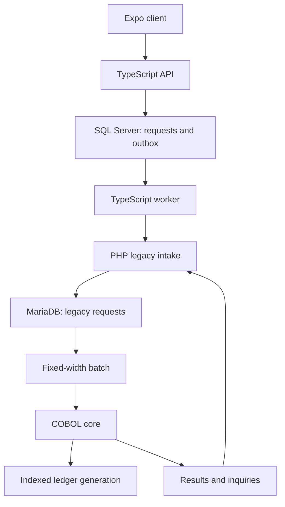

# Development guide

**v0.2 — second requirements review:** see [the review report](second-review.md) for gaps corrected and [validation evidence](validation.md) for the completed GitHub runtime checks and remaining device gate.

A working foundation for modernizing a fictional South African payroll bureau: PHP operations, a real COBOL batch core, a TypeScript bridge, Microsoft SQL Server, and an Expo client.

The bureau has been acquired by a fintech. An insurer is one of its employer clients. The first workflow allocates a client's prefunded balance to an employee payable balance. **Posted internally** means the internal ledger changed. External bank payout is a separate future workflow.

## What is included

| Part                  | Implementation                                                                                                                             |
| --------------------- | ------------------------------------------------------------------------------------------------------------------------------------------ |
| Old operations portal | PHP with operator login, allocation form, register, batch trigger, core inquiry, batch controls, and CSV exports                           |
| Old intake database   | MariaDB request queue, batch manifests, immutable batch membership, and inquiry records                                                    |
| Ledger authority      | GnuCOBOL indexed account and processed-reference journal files                                                                             |
| File orchestration    | Python runner serializes COBOL and atomically publishes complete generations                                                               |
| Modern backend        | TypeScript / Fastify API and separate worker                                                                                               |
| Modern persistence    | SQL Server request history, transactional outbox, leased jobs, status events, account projections, and reconciliation runs/findings        |
| Client                | Expo app for payroll, employee, and operations roles, with balances, history, recovery, reconciliation, and CSV report export/share        |
| Local infrastructure  | Seven Docker Compose services with named volumes and health checks                                                                         |
| Verification          | Core recovery tests, API/worker tests, legacy integration test, SQL integration test, full-stack smoke script, and GitHub Actions workflow |

See [validation evidence](validation.md) for checks actually run, including the passed Docker/SQL Server CI scenario.

## Start on Windows with Docker Desktop

Use Node.js 24 and Docker Desktop configured for Linux containers. Run these commands from the `bureau-bridge` repository root:

```powershell
node scripts/setup.mjs
docker compose up --build -d
docker compose ps
npm ci
npm run web
```

`setup.mjs` generates independent local credentials in `.env` and preserves an existing file. No generated credentials are included in this archive. Find `DEMO_PASSWORD` in your own `.env` for the demo sign-in.

- Modern API health: `http://localhost:3000/health`
- PHP operations portal: `http://localhost:8080` — username `operator`
- Expo web: use the URL Expo prints, normally `http://localhost:8081`

The modern app accepts these usernames with `DEMO_PASSWORD`:

| User            | Access                                                                       |
| --------------- | ---------------------------------------------------------------------------- |
| `insurer-admin` | Submit allocations and view the insurer's register                           |
| `employee-one`  | Read only allocations to `EMP000000001`                                      |
| `ops`           | Submit, inspect, inquire against the core, and verify/resume unresolved work |

The authentication is an explicit local demo implementation with signed one-hour sessions. A real identity provider is a future deployment task. The PHP server is its development server, intended for this local lab.

PHP refresher: PHP runs on the server. Here it handles operator forms, talks to MariaDB, returns HTML or JSON, and exports batch files. Recording a request in PHP does not move ledger value. COBOL applies the batch; TypeScript provides the modern API and worker; Expo supplies the client screens. MariaDB and SQL Server serve different application boundaries.

## Android and iOS

```powershell
npm run mobile
```

- Android emulator defaults to `http://10.0.2.2:3000`.
- iOS simulator and web default to `http://localhost:3000`.
- For a physical phone, set `API_BIND=0.0.0.0` in the root `.env`, recreate the API with `docker compose up -d api`, and set `EXPO_PUBLIC_API_URL=http://YOUR_PC_LAN_IP:3000` in `apps/mobile/.env`. Put the phone and PC on the same network, permit port 3000 on the private network, then restart Expo. Only the API URL belongs in the mobile env file.
- Use a compatible Expo Go release or the included EAS development build profile. `expo-dev-client` is installed. EAS needs your Expo account and, for signed iOS device builds, Apple provisioning. The repository has no EAS project ID or signing credentials yet.
- `npm run mobile` explicitly starts Expo Go. For an installed development client, run `npm run dev --workspace @bureau/mobile`.
- The local config plugin permits HTTP in development/preview builds so the lab API can be reached. The `production` EAS profile requires an HTTPS `EXPO_PUBLIC_API_URL` and disables that exception. Set this public URL in your EAS build environment before a production build.
- `eas.json` includes development, Android preview APK, and production profiles. Android/iOS JavaScript bundling does not prove a native binary was built or tested.

## Mobile appearance and navigation

The app starts in light mode. Use the moon/sun button for black-and-mint dark mode; your choice is retained on this device. Home shows timestamped core balances and recent activity. Allocate contains the payroll form; Activity contains the register, filters, history, and operations recovery controls. Operations users also have an Ops tab for comparisons and CSV export.

[The mobile design guide](mobile-design.md) covers the Tamagui configuration, colours, roles, browser checks, and screenshots.

## First allocation

1. Sign in to the Expo app as `insurer-admin`.
2. Open **Allocate** and send **R250.00** to Employee 1. The TypeScript API records **25,000 cents** and an outbox row in one SQL transaction.
3. The worker submits the same immutable reference to PHP. The client shows **Awaiting payroll batch**.
4. Open the PHP portal and click **Run pending batch**, or run:

   ```powershell
   docker compose exec legacy php /app/php/batch.php
   ```

5. COBOL applies the allocation and PHP imports its outcome. Within a few seconds, the modern client shows **Posted internally**.

The scheduler also runs at 08:00, 12:00, 16:00, and 23:00 in `Africa/Johannesburg`. Change `BATCH_TIMES` in `.env` to change those slots. This simple scheduler attempts each matching slot once; it does not backfill missed slots after downtime.

## Demonstrate a lost result

1. Submit a fresh allocation and wait for **Awaiting payroll batch**.
2. Run:

   ```powershell
   docker compose exec legacy php /app/php/batch.php --drop-result
   ```

   This deliberately exits with an error _after_ the core has committed, while withholding result import. The request becomes **Verifying core outcome**.

3. Sign in as `ops`, open **Activity**, and choose **Run core inquiry** on that allocation. The core returns its previously committed reference; PHP reconciles it and the worker updates the modern view.
4. **Verify and resume** also handles a request the core never committed. The legacy side checks its journal under the batch lock before returning an unposted request to intake. A committed request stays committed.

The client stores an unfinished request reference before sending it. Retrying after a network error or an app restart preserves that reference. API and core uniqueness checks enforce replay behavior independently.

## Data and recovery design



The COBOL program updates two account records and a journal record containing the source, destination, amount, outcome, and original reference. The runner makes a private copy of the previous indexed files, invokes COBOL, validates results and total balance conservation, closes/syncs files, and publishes a new generation by replacing one `current` symlink. A process lock serializes posting and inquiry. A failure before publication leaves the previous generation authoritative; a failure after publication is resolved by the processed reference.

The core runner assumes a local Linux filesystem on one machine with atomic rename and `fsync` semantics. Docker named volumes supply that model for this lab. This is a single-writer core; distributed writers and network filesystem deployment need another design. Generation pruning, backup/restore automation, and retention are not implemented.

The initial account master contains R100,000 in `INS000000001`, zero in two active employee payable accounts, and zero in suspended `EMP000000003`. A request to the suspended account is declined by the core. There is no deposit/payout endpoint. The conservation check therefore expects 10,000,000 total cents. The sample per-allocation limit is R50,000. These are invented demo business rules.

SQL Server holds process state only. It never becomes another writable balance ledger. The worker claims jobs with a time-limited lease; a replaced lease token cannot finalize a newer worker's job. Transient failures back off, then move to **Needs review** after six consecutive failures. A timeout never becomes **Posted internally**.

The fixed-width contract is documented in [file-contract.md](file-contract.md). The worker refreshes read-only account projections every 30 seconds and persists a cross-system reconciliation observation every 300 seconds. Configure `ACCOUNT_SYNC_SECONDS` and `RECONCILE_SECONDS` in `.env`. Balances show the committed core timestamp and generation; SQL Server never independently adjusts them. Older source sequences cannot replace newer projections.

Operations users can run a comparison from the Expo app and inspect payload/outcome mismatches, missing core references, pending imports, batch count/amount controls, and seed-plus-journal balance differences. PHP portal entries appear as informational `LEGACY_ONLY` work. A comparison can overlap an in-progress import, so findings are observations to investigate; scanning does not repost or repair money automatically. Each layer is limited to 5000 records in this demo. An incomplete scan is explicitly flagged and cannot claim a clean reconciliation.

The PHP portal exports request and batch-control CSVs. Operations users can export the latest reconciliation CSV from the modern app: web downloads a file, while Android/iOS share its CSV text. The app also shows allocation status history. The register displays the latest 100 modern allocations; reconciliation scans a larger inventory independently.

## API surface

| Method | Route                        | Purpose                                       |
| ------ | ---------------------------- | --------------------------------------------- |
| POST   | `/session`                   | Demo sign-in with username/password           |
| POST   | `/allocations`               | Create using a UUID `Idempotency-Key` header  |
| GET    | `/allocations`               | Role-filtered register                        |
| GET    | `/allocations/:id`           | Allocation and status history                 |
| GET    | `/accounts`                  | Role-filtered core balance projections        |
| POST   | `/allocations/:id/inquiry`   | Operations-only read of core outcome          |
| POST   | `/allocations/:id/resume`    | Operations-only verification and resumption   |
| GET    | `/reconciliation`            | Operations-only latest saved observation      |
| POST   | `/reconciliation`            | Operations-only comparison and saved findings |
| GET    | `/reconciliation/report.csv` | Operations-only latest CSV report             |

Except health and sign-in, send `Authorization: Bearer <session token>`. The shared allocation body is:

```json
{
  "sourceAccount": "INS000000001",
  "targetAccount": "EMP000000001",
  "amountMinor": 25000,
  "currency": "ZAR"
}
```

The internal PHP endpoints use a distinct bridge credential for intake/status and an operations credential for inquiry/recovery. The mobile app never receives either credential or database access.

Authenticated bridge reads at `/v1/accounts` and `/v1/reconciliation` expose committed balances and the intake/core inventory. Operator Basic authentication protects `/reports/requests.csv` and `/reports/batches.csv`; the portal's modifying forms also require a session form token.

## Checks

```powershell
npm run typecheck
npm test
```

On Linux with `gnucobol` installed:

```bash
npm run test:core
```

For the complete stack, run the SQL integration test before any allocations are created and with the worker stopped:

```powershell
docker compose stop worker scheduler
docker compose exec -T api npm run test:sql --workspace @bureau/server
docker compose up -d worker
npm run smoke
docker compose up -d scheduler
```

The smoke test creates allocations, posts a normal batch, loses a later result, checks inquiry recovery, declines a suspended target, and checks private balances, reconciliation, and CSV reports. It changes local demo data. The SQL test expects an otherwise empty outbox and cleans up its own rows. `tests/legacy_integration.php` and the server's `test:legacy-http` are lower-level tests for a disposable legacy database/core; CI runs them before the worker starts.

The GitHub Actions workflow installs dependencies, checks TypeScript and PHP syntax, runs core and real legacy HTTP/integration tests, builds containers, validates SQL behavior, and runs the full-stack smoke scenario. [The validation record](validation.md) links to its successful GitHub execution.

## Updating from v0.1

Keep your existing `.env` and named volumes. Apply schema changes before restarting the new application code:

```powershell
docker compose stop api worker scheduler
docker compose build
docker compose up -d legacy
docker compose run --rm sql-init
docker compose up -d api worker scheduler
```

The legacy entrypoint applies idempotent SQL scripts, and the modern initialization job applies both SQL scripts in transactions. No data reset is required.

The first core access upgrades a v0.1 generation in a private copy, preserves existing balances/journal, and adds the missing suspended account with zero value. It publishes this schema change atomically. Old batch membership is backfilled from references still present in the old register. Any membership already overwritten before this update cannot be reconstructed; batch-control discrepancies remain visible for investigation. The runtime update through Docker/SQL Server still needs the remaining validation gate.

## Shutdown and recovery

```powershell
docker compose logs --tail=100 api worker legacy
docker compose stop
docker compose start
```

Named volumes retain both databases, the core generations, and exchanged files. Keep `.env` alongside the project: regenerating passwords while reusing initialized database volumes will not rotate existing database credentials. Use `docker compose down` to remove containers while keeping volumes. Only use `docker compose down -v` when intentionally discarding all local demo data.

## Repository map

```text
apps/mobile/           Expo application
packages/contracts/    Shared TypeScript request types and validation
services/server/       TypeScript API, worker, SQL store and tests
legacy/php/            PHP portal, endpoints, batch exporter/importer
legacy/cobol/          Executable COBOL business logic
legacy/core-runner.py  Snapshot publication and core inquiry
legacy/scheduler.py    Local batch clock
database/              MariaDB and SQL Server initialization scripts
scripts/               Local setup and full-stack smoke scenario
tests/                 Core recovery and legacy integration tests
docs/                  Architecture, fixed-width contract, validation evidence
```

See the root README for the project overview and the documented validation boundaries.
